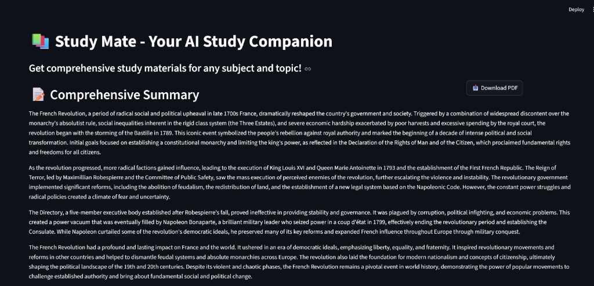
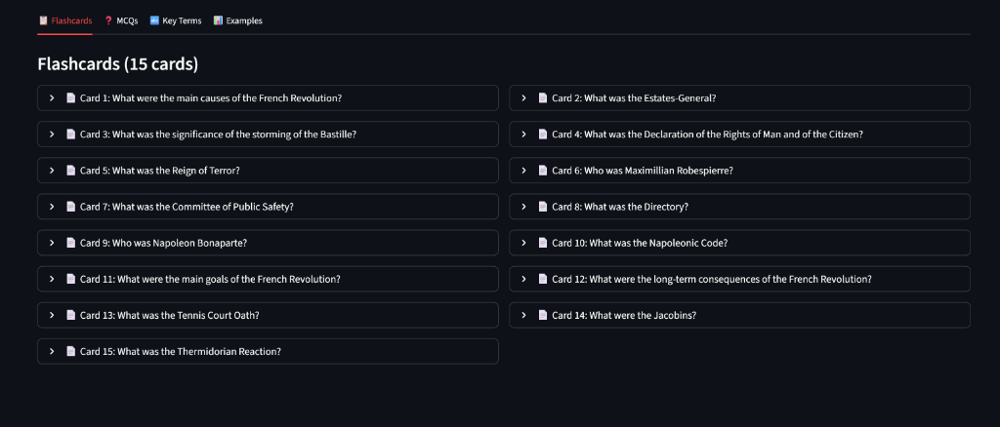

# 📚 Study Mate


**Study Mate** is your AI-powered study companion. It generates comprehensive study materials, including summaries, flashcards, multiple-choice questions (MCQs), and example problems for any subject and topic you choose.

## 🌟 Features

-   **Deep Summaries**: Get detailed, 4-6 paragraph summaries of complex topics.
-   **Smart Flashcards**: Automatically generated flashcards for quick revision.
-   **Interactive MCQs**: Test your knowledge with AI-generated questions and detailed explanations.
-   **Concept Clarification**: "Hard Terms" section explains difficult terminology simply.
-   **Practical Examples**: Step-by-step solutions to example problems.
-   **PDF Export**: Download comprehensive study guides to study offline.

## 📸 Screenshots

| Study Input | comprehensive Summary |
|:---:|:---:|
|  |  |

**Interactive Flashcards:**


## �🚀 Getting Started

### Prerequisites

-   Python 3.8 or higher
-   A [Google Cloud Project](https://console.cloud.google.com/) with the Gemini API enabled.
-   An API Key from [Google AI Studio](https://aistudio.google.com/).

### Installation

1.  **Clone the repository:**
    ```bash
    git clone https://github.com/amanshu999/study-mate.git
    cd study-mate
    ```

2.  **Create a virtual environment (optional but recommended):**
    ```bash
    python -m venv venv
    # Windows
    venv\Scripts\activate
    # macOS/Linux
    source venv/bin/activate
    ```

3.  **Install dependencies:**
    ```bash
    pip install -r requirements.txt
    ```

4.  **Set up configuration:**
    Create a `.env` file in the root directory and add your API key:
    ```env
    GEMINI_API_KEY=your_actual_api_key_here
    ```

### Usage

Run the Streamlit application:

```bash
streamlit run minorproject.py
```

Open your browser to the URL shown (usually `http://localhost:8501`). Enter a subject (e.g., "Physics") and a topic (e.g., "Quantum Mechanics"), then click **Generate Study Materials**.

## 🤝 Contributing

Contributions are welcome! Please read `CONTRIBUTING.md` for details on our code of conduct, and the process for submitting pull requests.

## 📄 License

This project is licensed under the MIT License - see the `LICENSE` file for details.

## 🔧 Credits

Built with ❤️ by **Amanshu Sharma**.
